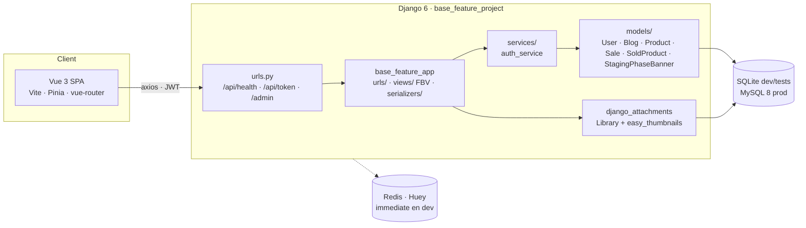
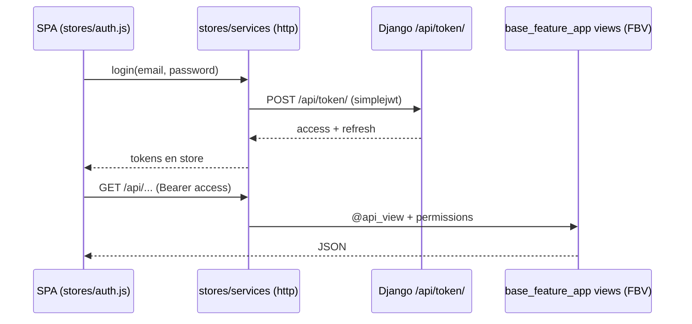
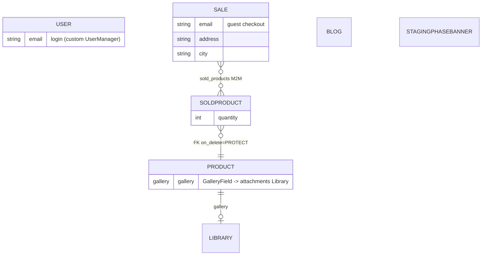

# Architecture — Base Django Vue Feature

## 1. System overview

- Dev/E2E: Playwright `webServer` boots Django `127.0.0.1:8001` + Vite `127.0.0.1:5174`; the SPA talks to the API via `VITE_BACKEND_URL`.
- Staging: gunicorn service `base_django_vue_feature_staging` + `base_django_vue_feature-staging-huey` (per fleet registry); Django serves no SPA catch-all — the frontend is built by Vite and served as static.

## 2. Request flow (auth example)

## 3. Data model (ER)

- `Sale` has **no FK to User** — checkout is by email (guest).
- `Sale.delete()` cleans up its own `SoldProduct` rows; products are PROTECTed.

## 4. Deployment (staging-only template)

- Work host: `vps-projectapp-staging`; path `/home/ryzepeck/webapps/base_django_vue_feature` (registry: status `scaffold`, no domain).
- CI: GitHub Actions (`ci.yml` — 3 test suites + coverage summary; `test-quality-gate.yml` — junk gate at error severity).
- The repo is **prod-direct** (no release branch): work lands via feature/qa branches + PR to `master`.

## 5. Current workflow (updated 2026-08-12)

- **QA closure run in progress** (`/qa --apply`, branch `qa/12082026`): backend venv provisioned (Django 6.0.5), SQLite dev seeded (admin user + 12 sales), Memory Bank regenerated, `USER_FLOW_MAP.md` being regenerated from code, coverage audit + per-layer test authoring to follow (target: close error/failure outcome gaps in the 20-flow map).
